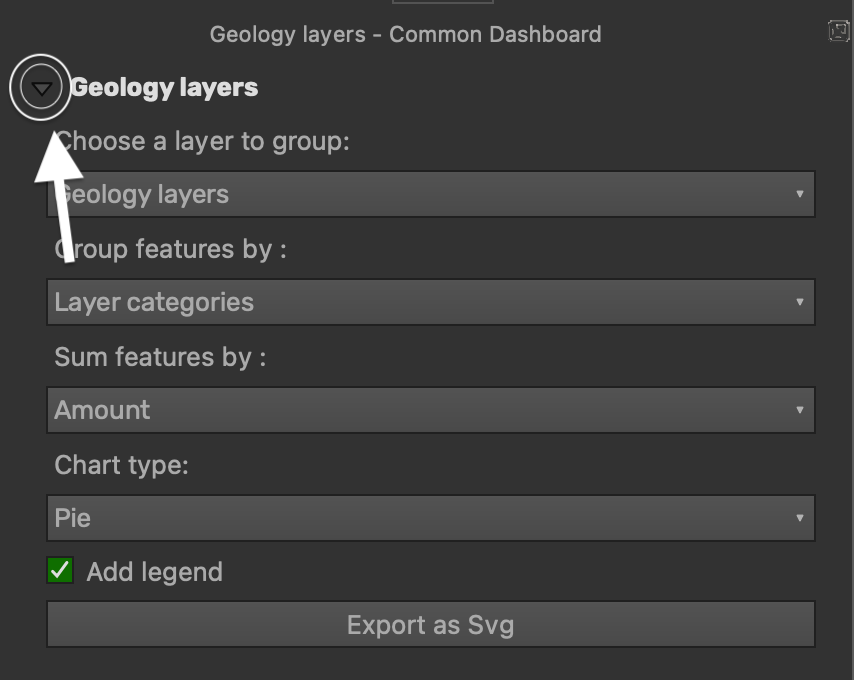

# CommonChart
A QGiS plugin enabling very basic chart visualization for vector layers. Chart are opened on seaprate scaleble user panels so that grouping and stacking of various cahrts into a full updated dashboard is easy.
 

</img>

 
## Easy to start:
- Press the CommonChart icon to open a new CommonChart pannel
- Keep opening as many CommonChart pannels a you like. Pannels can be sorted as a side dock side by side or stocked together with other pannels as tabs
- 
### Choose data
- Use the Layers menu to pick which layer data you want visuallize
- Choose the field you want aggregation to be grouped by
- Choose what data you want to sum up (Numeric fields only)

### Change visualisation
- For now display is limited only to bars or pie charts.
- Display legend bellow chart figure. Chart's objects have basic tool tip showing category's label on hovering above it.
- For now, bars chart will show summed up numbers for each category while pie charts display precentage of total categories.
- Advanced styling using CSS is accessible when exporting as SVG. Use ids "Chart" or "Legend" for those grouped objects. "Polygons","Labels","InnerLabels" classes are availbale for styling every chart element separatly while "LegendItems" and "LegendLabels" classes exist legend items.
- Change the <filter> on the top of code to aplly filter effects on Chart group object
- Hopefully migration to Qt6 on QGiS new coming V4.0 will open up new options for advanced svg drawing. This includes inserting CSS and dynamic interaction with elements of the chart in qgis without exporting.

## Show your chart
<b> Show chart by collapsing the settings box</b> 
(Clicking the arrow by the top left corner)  
 
</img>
 
<b> Or export chart as SVG </b>

## Limitations and under the hood explained:
- Charts calculations are done using qgis's virtual layers. Virtual layers are constructed with SQL which makes them quite fast. Unfortunately this makes any Qgs Expressions or virtual field invisible, since the virtual layers query the source of the layer directly. For some reason, at the moment, that goes for Temporary layers as well (Memory based).  
- Coloring of the charts derive it's schemes from the layer's category renderer or from project's colors settings. For the moment no more options are available.
  -  Based on layer's styling if it's categoriesed. Category's symbol will only work for fill symbols (patterns, dot and gradients fill included). For now fill is created using tiles of 60x60 pixels.  Depending on the symbolgy's inner patterns this can sometimes cause a visible unwanted grid shaped pattern.
  -  Random assignment of colors derived from project's colors settings. Using project colors limits the number of shown categories to the number of given colors. all other categories will be summed together        to a new 'All others' category. Charts are drawn from largest parts to the smallest ones so that colors aren't always assigned to the same categories.
